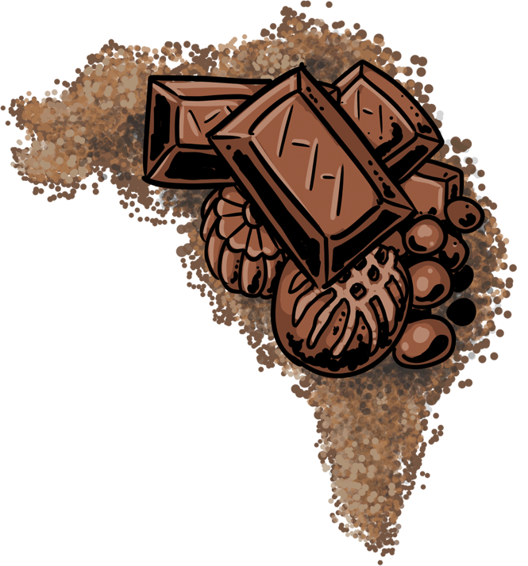
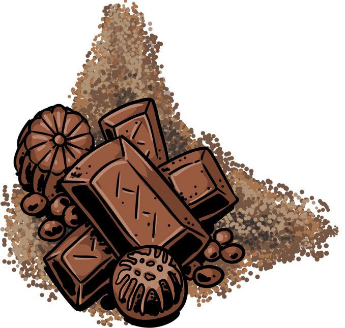
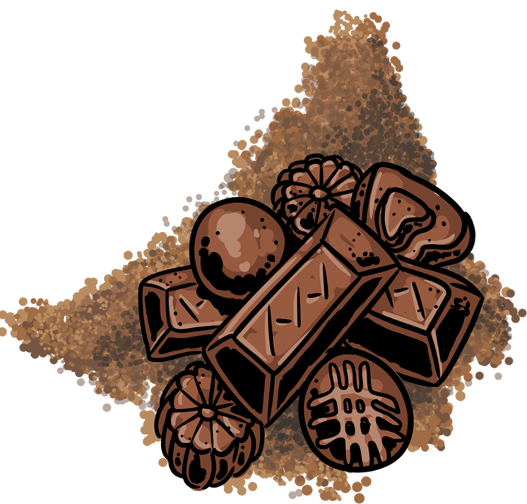
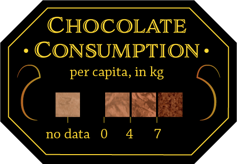
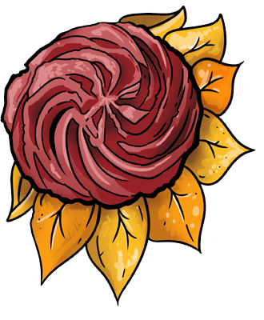
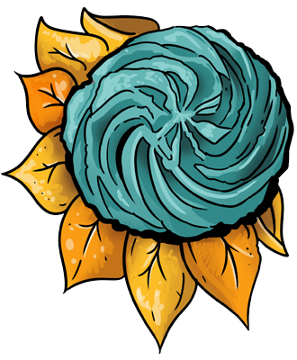
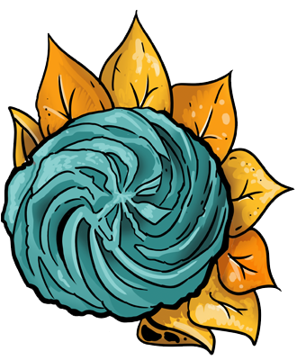
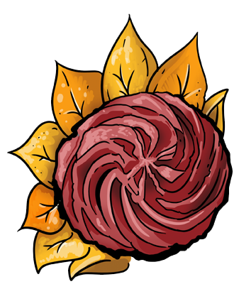
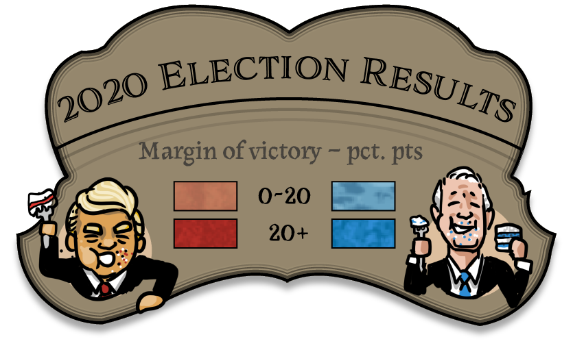
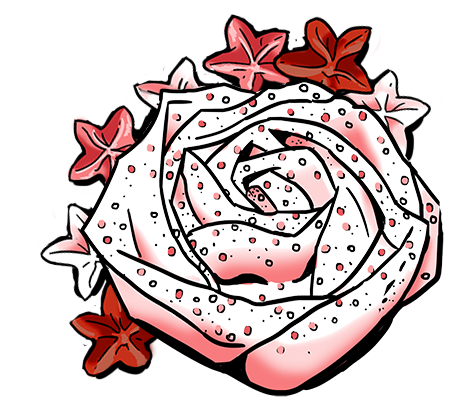



Baked with <a href="https://twitter.com/hurricanevicky" target="_blank">Vicky Johnson-dahl</a> & <a href="https://twitter.com/KatieKowalsky" target="_blank">Katie Kowalsky</a>

[[in 2016(?) three friends at NACIS decided new technology should be used to make CAKE MAPS.]]

Four years and X cakes later, here are our bakes, for your judgement and delight.

 

1.
The Signature


[[ description of signature bake... anyonoe got a story of chocolate? ]]

 
 

{::nomarkdown}
  </article>
</section>

  

  
  
  
  
  

  

  

  

  </img>
  

  

<section class="article-container article-cotainer__within">
  <article class="article-content article-content_middle">
{:/}

2.
The Technical Challenge


[[ description of vanilla map... representing election data... Acknowledgement that this should be a cartogram for electoral college or weighted by pop? ]]

 
 
 

{::nomarkdown}
  </article>
</section>

  

  

    
    
    
    
    

    

    

    

    

    </img>
    

  

<section class="article-container article-cotainer__within">
  <article class="article-content article-content_middle">
{:/}

3.
The Showstopper


[[ description of red velvet cake w/ sugar stars. Paul most global, likely because of his thing being 'bread' and sticking around the longest ]]

 
 

{::nomarkdown}
  </article>
</section>

  

  
  
  
  
  

  

  

  

  

  </img>
  </img>

  

<section class="article-container article-cotainer__within">
  <article class="article-content article-content_middle">
{:/}

 
 



------

{::nomarkdown}

  <i>-Dylan, Vicky, Katie 
  November, 26 2020</i>

  
All maps made w/ <a href="https://www.mapbox.com/about/maps/" target="_blank">Mapbox</a>, using <a href="http://www.openstreetmap.org/about/" target="_blank">OpenStreetMap</a> data. <a href="https://apps.mapbox.com/feedback/?owner=dmoriarty&id=ckfxb2lit031w19sxw3sauitl&access_token=pk.eyJ1IjoiZG1vcmlhcnR5IiwiYSI6Ikd3T29EOWMifQ.-DKJ4ernht84AZmc6Bk51Q" target="_blank">Improve the maps!</a>

  
All cakes baked by <a href="https://twitter.com/hurricanevicky">Vicky Johnson-dahl</a>, using [CAKE MIXES? RECIPES?]. Improve your baking! (<- link to cookbook?)

  
Election data is from AP and the chocolate consumption data from Statista. Information on the bake off we compiled.

  
Vicky's cakes were photographed and in some cases <i>scanned</i>, then a combo of Photoshop and Illustrator were used to make em' into repeatible textures. I've done a quick walkthrough on how to do that you can <a href="https://www.youtube.com/watch?v=MqJtQDAl4aY" target="_blank">view here</a>.

  
Big ol' tip of the hat to other great cake cartos:

  
<a href="https://twitter.com/rjnskl/status/1325116410582937603" target="_blank">Mira Rojanasakul's cartogram map</a>

  
<a href="https://lyzidiamond.com/posts/osgeo-august-meeting" target="_blank">Lyzi Diamond</a>

  - Mira 

{:/}

