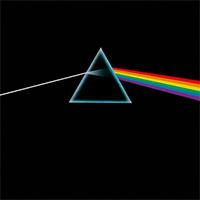
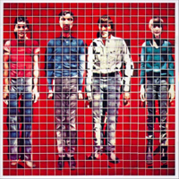
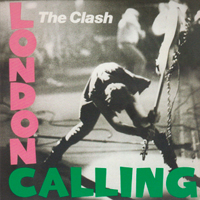
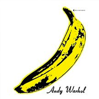
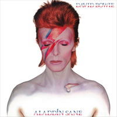

{::nomarkdown}
  </article>
</section>
 

  <fig>
    
  </fig>

<section class="article-container article-cotainer__within">
  

  <article class="article-content article-content_middle">

  

    
    <i>Hover for Companion tunes</i>
    
  

  

    <iframe width="100%" height="200" src="https://www.youtube.com/embed/videoseries?list=PL1KbmvLItolRiAYh6GwchueeM6kDO-6nh" frameborder="0" allow="autoplay; encrypted-media" allowfullscreen></iframe>
  

{:/}

You've probably seen a map inspired by Joy Division's _Unknown Pleasures_ at some point. It's a simple and beautiful cover of stacked radio waves that has led to a great many cartographic tributes. For example:



From <a href="https://www.reddit.com/r/dataisbeautiful/comments/lgrtbq/oc_germanys_population_density_as_a_joy_plot_map/" target="_blank">kudos blooms on Reddit</a>, to write ups by everyone from <a href="https://cartographicperspectives.org/index.php/journal/article/view/1536/1726" target="_blank">Cartographic Persectives</a> to <a href="https://www.vice.com/en/article/d748kz/digital-maps-inspired-by-joy-divisions-unknown-pleasures-album-art" target="_blank">Vice</a>. Lining the storefronts of <a href="https://www.etsy.com/listing/614935069/topo-lines-world-map-print-physical?ga_order=most_relevant&ga_search_type=all&ga_view_type=gallery&ga_search_query=topo-lines+joy&ref=sr_gallery-1-2&organic_search_click=1&pro=1&frs=1&col=1" target="_blank">kitschy Etsy stores</a>, truly, it's a well trodden, well loved style.

Odd, then, that we stopped there. 

Surely in the vast ocean of famous album covers, there are _other_ designs we can take inspiration from.....from which we launch _our own_ kitschy Etsy stores!!!





We gotta start with the reigning champ of famous covers, Pink Floyd's 

‘Unknown Pleasure’ translates to rising and falling elevation data. here there’s a white line entering a prism and exiting as a brilliant rainbow to work with. A great analogue for the lines that make up roads, & road maps are <a href="https://www.etsy.com/search?q=city%20road%20map" target="_blank">hot hot hot</a>!

Unconvinced?

True, true, roads twist and turn and overlap in ways that aren’t conducive to clean straight rainbows… but why let that stop us? Let's fill the world with some color:

{::nomarkdown}
  </article>
</section>

  
Turn On Labels

  
Unlock Map

  

    
  

  

  

  

  

  
&#9650;

<section class="article-container article-cotainer__within">
  <article class="article-content article-content_middle">
{:/}



First introduced at the end of the 40’s, Polaroids remain strong with the trendy. Buoyed by Urban Outfitters and Taylor Swift, the technology has outlived its parent company by a decade. Every time someone writes a "<a href="https://www.google.com/search?q=gen+z+polaroids&oq=gen+z+polaroids&aqs=chrome..69i57j0i22i30.4344j1j4&sourceid=chrome&ie=UTF-8" target="_blank">[the youth] have brought back [old thing]</a>" piece a marketer gets their wings. Polaroids alone have lifted flocks upon flocks.

In ’78 the Talking Heads released their sophmore album . Here the cover featured the band diced up by Polaroids, and reas
sembled into people shapes.

There are no satellites (that I know of) with Polaroid cameras aboard. We'll have to settle for multi-spectral instruments instead.



  <fig>
    
  </fig>

  
  



We can go further. Sure, each pixel in the above images contains countless buildings and food, but not as a resolution we can make out. 

For better or worse (for better), there isn't (publicly available) satellite imagery that captures the gooeyness of Wisconsin mac n’ cheese. The confusing monument that is Wall Drug. The iconic mistake that is the Seattle Space Needle.

But we can –





_Aside_ – the back side of _More Songs About Buildings and Food_ <a href="https://landsat.gsfc.nasa.gov/article/now-then-history-portrait-usa" target="_blank">features one of the first false-color nation-wide composites</a>. Published five years after the first nationwide composite of Landsat imagery, the linear notes correctly describe applications Landsat analysis will eventually provide. Wonderfully forward thinking and a fun historical overlap between music and cartography.



Our first two efforts require a lot of overhead to produce. Would be nice if we could find something with mass appeal and a quicker turnaround.

Let's go back to the 1950's. Where a simple, yet distinctive style graced _Elvis_'s , and later The Clash's 





  
  



Heck, if we really want to save time, we can just automate this style. Give it a whirl below! I've included optional guides you can turn on to better tell which cities are available to Clash-ify. 



  
Turn On Guides

  
Unlock Map

  

    
  

  

  

  

  





So far we’ve avoided referencing our inspirations in the pieces themselves. Perhaps that’s a missed opportunity.

Playful and irreverent, the Velvet Underground's  cover featured no musicians, or any indications of who or what the band was. Instead, Andy Warhol designed them a banana and his signature. An early interactive, you could peel the banana, which would just reveal a pink banana beneath.

Conveniently, Manhattan is geographically a banana. What better way to pay tribute to these icons of the 60's than merging icon and place.

Go ahead, give it a peel:



  <video id="velvetGoldmine">
    <source src="{{ site.baseurl }}/assets/graphics/posts/12-covers/velvet.webm">
  </video>
  



If only Minneapolis was Prince shaped.



It seems, perhaps, Unknown Pleasures enjoys success thanks less to the _aesthetic_, and more the utility of it. There are certainly more use cases for stacked lines of varying values in map making than, say, mountain tops colored like a space rocker's .



  <fig>
    
  </fig>
  

    
  

  

    

      
      
    

  



Still, what fun to see how far a concept can go.

{::nomarkdown}

  <i>Rock over London. Rock on, Chicago</i> 
  <i>QGIS. A Free and Open Source Geographic Information System</i> 
  <i>-Dylan 
  April, 4th 2021</i>

  <i>Dark Side</i> was made using data from OpenStreetMap. The Interactive version is using Mapbox GL, and their road & imagery data.

  
<i>More Maps About Building and Food</i> was made using Sentinel 2's 2019 June <a href="https://s2maps.eu/">cloudless composite</a>. The <i>Calling Maps</i> were likewise made using Sentinel imagery, and Mapbox again for the interactive iteration.

  
<i>Aladdin Mt.</i> was made using SRTM 30m data pulled from Google Earth Engine. <i>Map For Drella</i> is a mashup of Microsoft's building database and OpenData NYC.

  
This all started with parodying <i>Unknown Pleasures</i> with <i>Dark Side of the Moon</i>. There's a spectacular iteration of that idea that could be done using Turf.js to calculate the velocity of all roads coming out of the triangle to ensure the rainbow roads are perfectly straight... but perfect is the enemy of having weekends.

  
I do realize this batch leans super heavy on 60's & 70's ablum covers... but it's difficult to think of modern day one's that are as ubiquitous. Between most music being consumed digitally, the sheer volume of releases, and that we all have our own personal digital DJ's now it just doesn't feel like music is as shared an experience as it had been.

  
The Talking Heads inspired map took the longest, thanks to taking three different approaches. First I tried to load ~350 Mapbox maps on the page, idea being each iteration could be loaded with at a different zoom/center point. Turns out most web browsers limit how many web gl containers you can draw! So no dice there.

  
From there I turned to Landsat. Through Google Earth Engine I downloaded landsat composites cropped to ~350 different bounds... which worked! But, the Landsat imagery was way too choppy. There were lines from the composites visible even zoomed out all across the states. Snake eyes.

  
Luckily, a recent publication of Sentinel composites saved the day. I followed this wonderful tutorial on how to download batches of Sentinel imagery through AWS and was off to the races. After downloading the composites from 2019 for the U.S, merged them in QGIS, and then ran GDAL and Imagemagick to mosiac 500x500 chunks into what ya see here.

  
<i>Certainly</i> overkill, but again, a lot of fun.

  
Unused ideas: The Beatles – where all features are white but are styled to be have faint shadows like they were embossed. Sgt.Peppers, but with all the worlds countries standing upright. Queen II - with four mountains all named 'Queen Mountain' arranged under a northern spotlight. DAMN., but all the DAMS in a country... so, so much to do.

  
Here's some outtakes~

  
  <figcaption>Tried out being more faithful to the roads routes, but oofda, wacky inflatable rainbow roads felt are no good.</figcaption>

  
  <figcaption>I didn't master the offsets, but at least you don't need 3d glasses to view it like this previous try.</figcaption>

  
  <figcaption>While you can't load 300+ Mapbox Maps on a page, it does make this fun visual. Help computer.</figcaption>

  
  <figcaption>Lots of errs when it came to automating the mosiac. Here's the first run with Landsat.</figcaption>

  
  <figcaption>Even when things were going smoother, still had some fun mishaps.</figcaption>

  
  <figcaption>Merging projected rasters is the thing of nightmares.</figcaption>

{:/}








